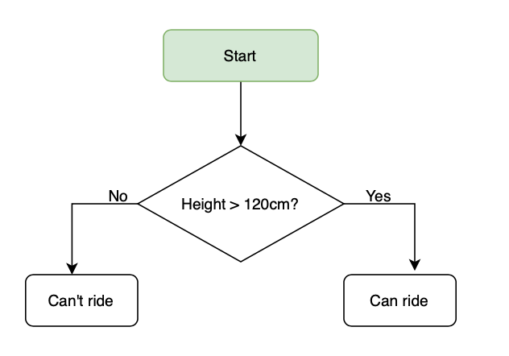
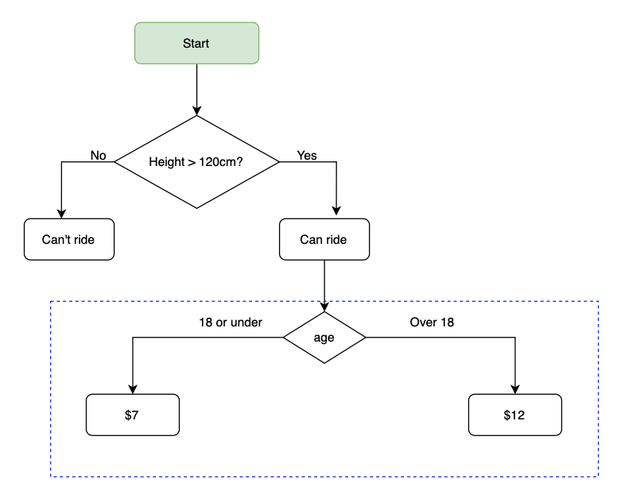
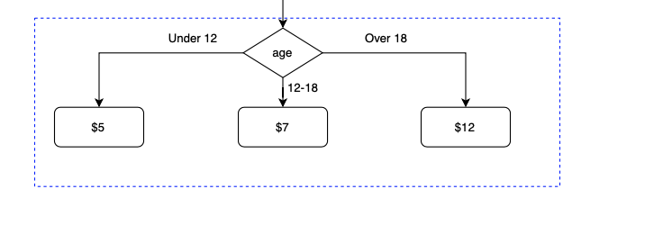
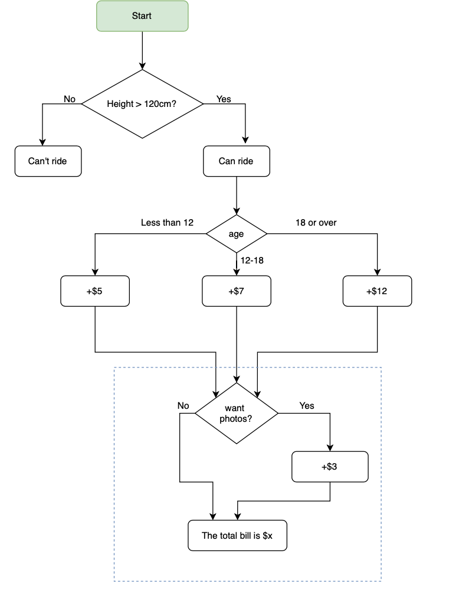

# Beginner Level Python Notes - Day 1 to Day 14
<br>


### Day 1 - Print, String Manipulation, Input, Variable

<br>

> [Day 1 Project - Band Name Generator](Day%201%20Project%20-%20Band%20Name%20Generator)

<br>

 1.1 `print( )` function, double quotes vs. single quotes
  - ❗️Double quote "" and single quote '' can be used interchangable. but a set of double quote cannot work with double quote again, same with singer quotes.

  - ❗️Don’t put spaces or tab before the code, you will get indentation error


```python
print(“hello world!”)✅
print(‘hello world!’)✅
print("print('hello world’)”)✅
print(‘print("hello world”)’)✅
print(“print("hello world")”)❌
print(‘print('hello world')’)❌
```

 1.2 String manipulation
* `\n`for new line
```python
  print(“hello world\nhellonworld”)
  ```
* `+` for concat strings
```python
  print("hello"+"world")
 ```

 1.3 `input()` to show a prompt and ask input from user

 1.4 `#` for comment in python

 1.5 Variable naming rules:

* Use underscore`_` in variable name

* Can use number at the end of the variable name

* Cannot use function name as  your variable name


<br>

### Day 2 - Data Types, Number Operations

<br>

> [Day 2 Project - Tips Calculator](Day%202%20Project%20%2D%20Tips%20Calculator)

<br>

1. Data Types
  * `str` for string
    * like "Hello" has positions, and position always start at 0
    * position use a `[ ]` to specify has to be used within quotes
    * `+` in strings are concat, `+` in numbers are calculation
    
  * `int` for integer
    * numbers without decimal place, either negative or positive
    * underscore `_`used as thousand separator like 1,000,000
  
  * `float` for numbers with decimal place
  
  * `boolean` for Boolean `True` and `False`
    * `True` and `False` has to have first letter capitalized
    * Don't need quotes around it

2. Data Type Checking and Type Conversion

* Type Checking use `type()` function

* Type conversion
  * `str()` convert to string
  * `int()` convert to integer
  * `float()` convert to float number


3.Math Operations: `+`, `-`, `*`, `/`, and `x ** y` for x to the power y calculation

 - Division `/` always return a float data type
 
 - `%` called modula, will give you the reminder of the division : eg. `7 % 3 = 1`

 - Order of execution priority : PEMDAS
   - 1. Paranthesis `()`
   - 2. Exponents `**`
   - 3. Multiplication or Division `*` or `/`
   - 4. Addition or Submstraction `+` `-`
  > Same order will process from left to right
 
 - Shorthand for number manipulation
   - instead of use `a=a+2` we can use `a+=2`
   - same for `*=` `-=` `\=`

4. F-string
  - f-string allows you to not change data type and output like normal string
  - usually used with variable, and variable use `{}`
  - `print(f”My score is {score}")`

5. Number Manipulation
```python
print(int(8/3))  # chop off what's after decimal
print(round(8/3), 2)  # round to 2 decimal places
print(8//3)   # round down, works like floor function
{:0.2f} .format(9/2)  # if like 9/2=4.5, there's no way to round to 2 decimal place, then use this to format numbers

```
<br>

### Day 3 - Control Flow, Logic Operator

<br>

> [Day 3 Project - Treasure Island](Day%203%20Project%20%2D%20Treasure%20Island)

<br>

1. Conditional statement if/else

- Comparison operator
 - `=` is assign what's on the right to the left
 - `==` is check equality of what on the right with what’s on the right
 - `!=` is not equal to 
  > - The condition statement should return a `True` or `False`, this will give you a hint whether the condition statement is correct
  > - Indentation is important in `if/else` statement, it marks what code block will be executed, and you will get an indentation error if you you are doing it wrong




```python

if age == 12:
     do this
else:
    do this 

```

2. Nested if statement (mulitple layers of condition has to be met)



```python

 if height>120:
     if age>18:
        print("ticket is $12")
     else:
        print("ticket is $7")
   else:
      print("you cannot ride") 

```


3. `elif` statement  (choice or multiple options at the same level/layer)



```python
 if height>120:
     if age>18:
        print("ticket is $12")
     elif age>12 and age<18:
          print("ticket is $7")
     else:
        print("ticket is $5")
   else:
      print("you cannot ride")

```

4. Multiple if statement (no matter what the previous condition; order of execution)




```python
  # indentation is very important, will change the order of execution
  if height>120:
     if age>18:
        print("ticket is $12")
     elif age>12 and age<18:
          print("ticket is $7")
      else:
        print("ticket is $5")
  #below if is after the execution of the above if and as a seperate condition (not relate to age)      
      if want ticket:
        print("ticket+$3")
     #whether you buy or not buy ticket, you will need to print out line 14 so here don't need to put else, pay attention to the indentation
    print("your total ticket would be xx")
   else:
      print("you cannot ride")
```


5. Logic operator:  `and`, `or`, `not`

```python

if age == 12 and height<180 :
     do this
else:
    do this 

```

<br>

### Day 4 - Randomisation, Python List

<br>

> [Day 4 Project - Rock Paper Scissors](Day%204%20Project-%20Rock%20Paper%20Scissors)

<br>

1.  Creat randomness using Randome Module

```python
import random
print(random.randint(1,10))     #return a random number between 1 and 10 - [1,10]
print(random.random())         #can only return a random float between [0,1) -not include 1
print(random.random()*5)      # now give the ability to return a float [0,5)
```

2. Create Module and use it 
```python
import yvonne                        #module yvonne created by myself, with one variable in it yvonne="smile"
print(yvonne.yvonne)                   #  print(ModuleName.VarName)
```


3. [List - Data Structure](https://docs.python.org/3/tutorial/datastructures.html)

```python
#list - data structure
fruit=["apple","pear","banana","cherry"]     # way to create a list use []
print(fruit)
veggies = []                        # way to create an empty list
fruit=["apple",1,"banana","cherry"]            # list can have different data types
print(fruit)                                             #print the entire list
print(fruit[0])                                         # position start at 0
print(fruit[-1])                  # the last one in the list, index/position can be negative
fruit[1]="pear"                 # offset : change the value at position 1 to a new value
print(fruit)
fruit.append("c")             #append one value to the list
print(fruit)
fruit.extend(["a","b"])      # append a list to the existing list
print(fruit)
len(fruit)                      # return how many items in the list

random.choice(fruit)    # will pick randomly from the list
```


4. Nested List

- items has an order in the list, called index, will be used to call them out, so the order is very important

```python
fruits = ["Strawberries", "Nectarines", "Apples", "Grapes", "Peaches"]
vegetables = ["Spinach", "Kale", "Tomatoes", "Celery", "Potatoes"]
dirty_dozen = [fruits, vegetables]       # a nested list that has two lists
print(dirty_dozen[0]) 
print(dirty_dozen[1]) 
# first bracket [1] get the list of position 1, which is vegetable list
print(dirty_dozen[1][2]) # the index 2 of the index 1 list => the 3rd item in the 2nd list, which is tomatos

```


<br>

### Day 5 - For Loops

<br>

> [Day 5 Project - Password Generator](Day%205%20Project-%20Password%20Generator)

<br>


1. For loops in a list

```python
fruits=["apple","pear","orange"]
#"fruit" here is not defined before, but for loops defined it automatically
for fruit in fruits :
  print(fruit)
#indentation is very important in for loops
print(fruit)
```

2. For Loops with `range()`

```python
#for loops with range( ),range is getting number [1,5) include 1 but not include 5;
#to include 5, should use range(1,6), default step is 1
#range(1,5,2) meaning numbers between 1 and 4,each add 2 ==>result is 1,3
for i in range(1,5):
 print(i)
for i in range(1,5,2):
  print(i)
```

<br>

### Day 6 - Functions, While loops

<br>

> [Day 6 Project - Reeborg World Tests](Day%206%20Project%20-%20Reeborg%20World%20Tests)

<br>

1. [Built-in Functions](https://docs.python.org/3/library/functions.html)

2. Define function and call function

```python
def function_name():     # define function
  do this

function_name()   # call function 
```

3. While loops
- statement after while is true, then do this

```python
while not end_of_game:     #end_of_game=False, then <not end_of_game> will be True
  do this

while True :       # infinite loop
  do this 
```

<br>

### Day 7 - Project : Hanging Man

<br>

> [Day 7 - Project : Hanging Man](Day%207%20Project-%20Hanging%20Man)


<br>

### Day 8 - Function Parameter

<br>

> [Day 8 Project - Caesar Cipher](Day%208%20Project%2D%20Caesar%20Cipher)

<br>

1. Function with inputs

```python
   # here "a" is called "Parameter", 13 is called "Argument"  => pass argument to parameter
def my_function(a):
  a=13

#   Functions with more than 1 input
def sfun(a,b,c):
# when we pass sfun(1,2,3), they will follow the default position, this is "Position Argument"
sfun(1,2,3)
   #a=1 b=2 c=3

#in below case, it won't matter about the postion, this is "Keyword Argument"
sfun(a=2,b=3,c=1)
  #a=2,b=3,c=1
 ```
<br> 
 
### Day 9 - Dictionary

<br>

> [Day 9 Project - Blind Auction](Day%209%20Project-%20Blind%20Auction)


<br>

- Dictionary is a data structure that has "key" and "value"

```python
dict={}    # create empty dictionary
programming_dictionary = {
  "Bug": "An error in a program that prevents the program from running as expected.", 
  "Function": "A piece of code that you can easily call over and over again.",
}

#retrieving item from the dictionary, has to use key, and be sure to spell correctly
programming_dictionary["Bug"]

#adding item to the dictionary
programming_dictionary["Loop"]="a loop."
print(programming_dictionary)

#creat empty dictionary
empty_dictionary={}

#wipe out/clear the existing dictionary
programming_dictionary={}

#edit an item in dictionary
programming_dictionary["Bug"]="a moth"

#loop through a dictionary
for key in programming_dictionary:
  print(key) #get the key
  print(programming_dictionary[key]) #get the value of the key
```

- Unlike List, dictionary doesn't have positions, so knowing the name of the "key" is very important
- Dictionaries are used when order of elements are not important
- Dictionary and list can be nested in each other


<br>

### Day 10 - Function with output

<br>

> [Day 10 Project - Basic Calculator](Day%2010%20Project%20-%20Basic%20Calculator)

<br>

- Function with output


 ```python
 def add_numbers(b,c):
    a=b+c
    return a
 
 n=add_numbers(1,2)
 print(n)          #n=3
 ```
 
- Simpler version can be 

```python
 def add_numbers(b,c):
    return b+c
 
 n=add_numbers(1,2)
 print(n)          #n=3
 ``` 
- Can also return `True` or `False` or a string

```python
 def print_string():
    return "You are the best"
 
 print(print_string())          #print out "You are the best"
 
 def always_true ():
   return True
 
 is_game=always_true()      # is_game=True
 
 ``` 

<br>

### Day 11 - Capstone project : BlackJack

<br>

>[Day 11 - Capstone project : BlackJack](Day%2011%20Project%20-%20Black%20Jack%20Game)


<br>

### Day 12 - Scope: Global variable and Local variable

<br>

> [Day 12 Project - Number Guessing](Day%2012%20Project%20-%20Number%20Guessing)

<br>

- Local variable vs. Global variable

```python
##Local variable vs. Global variable
enemies = 1

#within function is local
def increase_enemies():
  enemies = 2
  print(f"enemies inside function: {enemies}")

increase_enemies()
print(f"enemies outside function: {enemies}")

#There's no block scope
#ie. within if/loops are global variable

#Best practice : use upper case for Global constants (variables don't change)
PI=3.14159
URL="xxxxxx"
```
<br>

### Day 13 - Debugging

<br>

- Ways to debug
  - Describe the problem
    - What's the for loop doing?
    - What's the if statement doing
    - What's the function is doing?
    - What are your assumptions?
  - Reproduce the error to see when exactly the error happens
  - Play Computer : make sure conditions are mutually exclusive
  - Pay attention to the error message
  - Create test cases to test every case
  - Use `print()` function often to verify your results
  - Use [Python Tutor](https://pythontutor.com/visualize.html#mode=edit) to debug
 

```python
## Please debug the below:

# Describe Problem

def my_function():
  for i in range(1, 20):    # correct should be: for i in range(1, 21):
    if i == 20:
      print("You got it")
my_function()

# Reproduce the Bug

from random import randint
dice_imgs = ["❶", "❷", "❸", "❹", "❺", "❻"]
dice_num = randint(1, 6)      # correct should be : dice_num = randint(1, 5) 
print(dice_imgs[dice_num])

# Play the Computer 

year = int(input("What's your year of birth?"))
if year > 1980 and year < 1994:
  print("You are a millenial.")
elif year > 1994:               # correct should be:   elif year >= 1994:
  print("You are a Gen Z.")


# Fix the Errors

age = input("How old are you?")      # correct should be :age = int(nput("How old are you?"))
if age > 18:
  print(f"You can drive at age {age}.")

#Print is Your Friend

pages = 0
word_per_page = 0
pages = int(input("Number of pages: "))
word_per_page == int(input("Number of words per page: "))  # correct should be word_per_page = int(input("Number of words per page: "))
#print(word_per_page)
#print(pages)
total_words = pages * word_per_page
print(total_words)

#Use a Debugger

def mutate(a_list):
  b_list = []
  for item in a_list:
    new_item = item * 2
  b_list.append(new_item)    # this line should be within for loop block, ie. indented
  print(b_list)

mutate([1,2,3,5,8,13])
```


<br>

### Day 14 - Project : Higher Lower Game of Ins Followers

<br>

>[Day 14 - Project : Higher Lower Game of Ins Followers](Day%2014%20Project%20-%20Ins%20Follower%20Higher%20Lower%20Game)


<br>


<br>

## Related Resources

<br>

-  [Text to ASCII Art Generator](http://patorjk.com/software/taag/#p=display&f=Graffiti&t=Type%20Something%20)
-  [ASCII Art](https://ascii.co.uk/art)
-  [Create Flow Chart Online](https://app.diagrams.net)
-  [Python Tutor](https://pythontutor.com/visualize.html#mode=edit)


 
